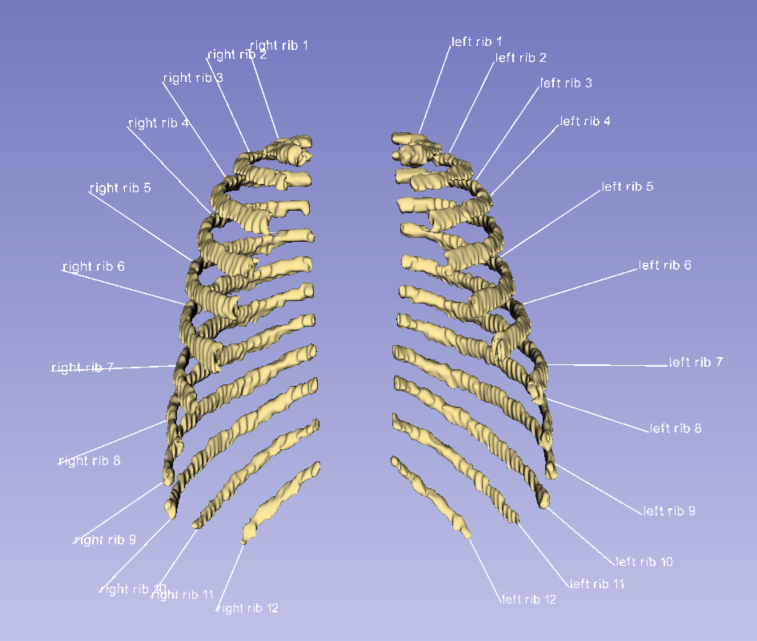
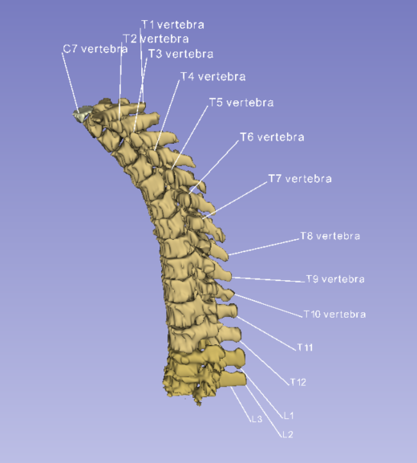

# 3D Segmentation Tags for 3D Slicer  
*(Auto-generated anatomical labels with leader lines in 3D view)*

<p align="center">
  
  
</p>

---

## Overview

This script automatically adds **3D anatomical labels** to each segment in a 3D Slicer segmentation.  
It places readable text tags around the model, draws leader lines from the actual surface, and keeps visibility synchronized with the Segmentation Editor.

Useful for:

- Anatomy visualization  
- Label QC / review  
- Educational content  
- Automated documentation of segmentation work  

---

## Features

### ✔ Accurate label placement
- Computes the **global center** and the **outermost surface point** of each segment.  
- Leader lines start from a **real surface point**, not a bounding box approximation.

### ✔ Leader lines for clarity
- Drawn from surface → offset label location  
- Reduces visual confusion in dense 3D scenes.

### ✔ Visibility sync
- Hiding a segment (eye icon) also hides its tag.  
- Works for both text labels and leader lines.

### ✔ Floating control panel
- Always-on-top window  
- Toggle ON/OFF  
- Size presets: S / M / L / XL  

### ✔ Console shortcuts
- `t()` → toggle tags  
- `s(5)` → change size  

---

## Installation

**Note:** Tested on **3D Slicer 5.6+**. Older versions may have different API structures.

You can run the script in **two ways**:

---

### **Option A — Quick Start (Copy & Paste)**

1. Open the **Python Interactor** in 3D Slicer.  
2. Copy/paste the entire script.  
3. The floating **3D Tags** panel will appear automatically.

---

### **Option B — Run from a `.py` file**

Save the script locally, e.g.: `C:\path\to\tag_control.py`

Run this in the Slicer Python console:
```python
exec(open(r"C:\path\to\tag_control.py").read())
```

This loads:

- the UI window
- all functions (`t()`, `s(size)`)
- automatic visibility sync
- tag generation logic

## Important Notes for Copy-Paste Users (Option A)

If you paste the script directly into the Python Interactor:

- All functions (`t()`, `s()`, `createTags()`, etc.) are automatically registered in the global `slicer` namespace.
- The floating **3D Tags** panel appears immediately.
- If you accidentally close the panel, reopen it using:

```python
slicer.tagControlWindow.show()
```

- If Slicer restarts, the functions disappear. Simply re-paste the script or load the .py file again.

## Usage

### Create tags

Click the **ON / OFF** button  
or run:

```python
t()
```

### Change label size

```python
s(3)    # small
s(5)    # medium
s(7)    # large
s(10)   # extra large
```

### Regenerate tags

Toggle OFF → ON
or simply re-run the script.

## File Structure (Suggested)

```text
3d-tags/
│
├─ tag_control.py
├─ README.md
├─ LICENSE
└─ images/
    ├─ rib_labels.png
    └─ spine_labels.png
```

## Known Limitations

- Text overlap is not fully optimized (planned label-repulsion algorithm).  
- Background rectangles behind text are not included in this version.  
- Dense models may require manual camera adjustment.

---

## Planned Improvements

- Automatic text-overlap avoidance  
- Background box behind text labels  
- Group-based label colors  
- Screen-space text rendering option  

---

## License

This project is licensed under the **MIT License**.  
See the `LICENSE` file for full details.

---

## Author

**Eunseo Heo (esheo-skia)**  
Contact: **heunseo1787@gmail.com**  
GitHub: **https://github.com/esheo-skia**

